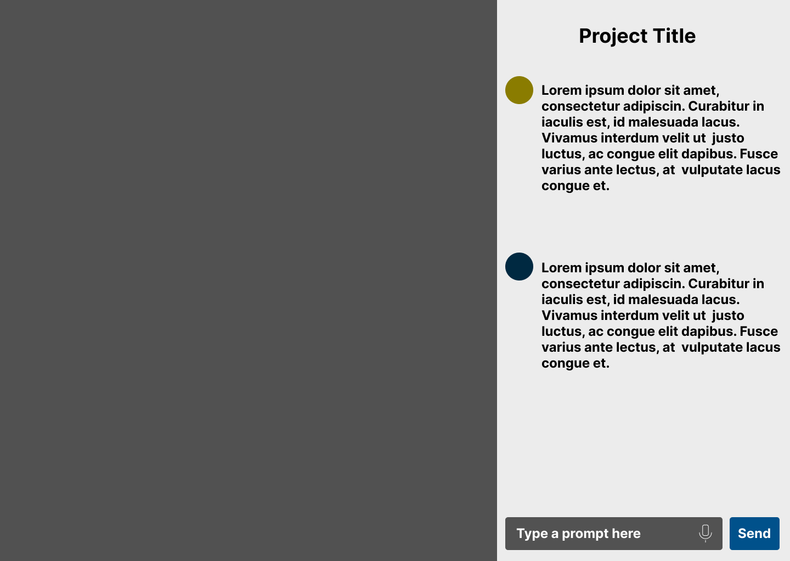

<br><br>

<!-- project philosophy -->


> Minedev, a VS Code extension, revolutionizes programming by providing example code blocks instead of directly providing code solutions.
>
> Minedev has the ability to have full context of the whole folder structure of a specific project.
>
> Minedev has a chat feature that allows developers to chat and talk with an AI trained model.
>
> This approach prevents developers from copying and pasting code without understanding the deep details of what they are implementing.

### Minedev User Stories by User Type

**User Type 1: Developer**

* **Explore Implementation Options:**  
  * As a developer using Minedev, I want to describe a feature I need to implement, so the AI can suggest relevant code block examples from my project or public repositories. 
  * This will allow me to explore different approaches and understand how similar functionalities have been implemented before.
* **Contextual Code Guidance:**  
  * As a developer using Minedev, I want to select a specific code block within my project and ask the AI to explain its purpose and functionality in the context of the surrounding code. 
  * This will help me understand existing code better and modify it confidently.
* **AI Debugging Assistant:**  
  * As a developer using Minedev, I want to describe an error message I'm encountering, and the AI can suggest relevant code block examples from my project or public repositories that might help fix the issue. 
  * This will save me time debugging and allow me to learn from common solutions.

**User Type 2: Company Admin**

* **Enforce Coding Standards:**  
  * As a company admin using Minedev, I want to define a set of coding standards and best practices for my team. 
  * Minedev should then prioritize code block examples that adhere to these standards when responding to developer queries.
* **Security Control:**  
  * As a company admin using Minedev, I want to restrict the AI from suggesting code examples that contain security vulnerabilities or expose sensitive data. 
  * This will ensure the code used by my developers adheres to security best practices.
* **Company-Specific Code Examples:**  
  * As a company admin using Minedev, I want to upload a library of pre-approved code snippets and functionalities specific to our company's codebase. 
  * Minedev should prioritize suggesting these examples to developers working on projects within our company. 


<br><br>
<!-- Tech stack -->


###  Minedev is built using the following technologies:

- This project uses the [Django](https://www.djangoproject.com/) Web Framework hosted on a dedicated EC2 instance.
- For persistent storage (database), the app uses PostgreSQL hosted on AWS RDS service.
- VS Code exension was built using React JS library.
- [Llama3](https://llama.meta.com/llama3/) Large Language Model hosted on a dedicated AWS EC2 instance with GPU support. LLM was served using [Ollama](https://ollama.com/).
- [Eleven Labs](https://elevenlabs.io/) was used for voice cloning and text-to-speech synthesis.

<br><br>
<!-- UI UX -->


> We designed Minedev using wireframes and mockups, iterating on the design until we reached the ideal layout for easy navigation and a seamless user experience.

- Project Figma design [figma](https://www.figma.com/file/LsuOx5Wnh5YTGSEtrgvz4l/Purrfect-Pals?type=design&node-id=257%3A79&mode=design&t=adzbABt5hbb91ucZ-1)


### Mockups
| Chatbot screen  |
| ---| 
|  |

<br><br>

<!-- Database Design -->


###  Architecting Data Excellence: Innovative Database Design Strategies:


<br><br>


<!-- Implementation -->


### Screens (Web/VS Code Extension)
#### Home Page screen  
 

|Chatbot screen |  AI Speech screen |
| ---| ---|
|  |  |

<br><br>


<!-- Prompt Engineering -->


###  Mastering AI Interaction: Unveiling the Power of Prompt Engineering:

- Leveraging advanced prompt engineering methods, this project optimizes the interaction with NLP models. By carefully
crafting tailored input prompts, we influence the model's behavior, enabling precise and efficient language comprehension and generation for diverse applications and user preferences.

- **Workspace Title generation according to workspace files and directories:** "Here is my workspace tree please generate a suitable title for my project. You are strictly prompted to just give an answer with the title only, no introductions nothing else is allowed. Just return project title, do not use same title as the main folder, your answer should contain only english characters no quotes or other symbols, you are allowed to add spaces between words. Important note: title should be strictly no longer than 3 words: {workspaceTree}"

- **AI Pair Programmer speech generation:** "Rules: You are an AI pair programmer. You give suggestions and help me think in an innovative way to complete my programming project. I want you to respond as if you are speaking in a friendly way be concise and helpful. Stick with two sentences as a maximum response. The following is me speaking to you. Respond according to the rules: {speech_text}"

- **Chatbot Response generation:** "Rules: You are an AI Pair Programmer that assists the developer by structuring ideas and giving them concise answers without unneeded introductions. You are going to be given hierarchy of the user's workspace, you are going to analyze it thoroughly. In some of your responses you might have to tell the user to navigate to a specific file according to the hierarchy, so that you will have to respond using strictly the following format HTML tag `<a href="FILE PATH HERE">FILE NAME HERE</a>`. Note: The file path should only be related to the hierarchy and nothing else. You are not allowed to give the user complete code, instead assist the user by giving procedures or steps so that the developer would depend on his/her skills to write their own code. Abide by the rules. Here is the chat history between you and the user: {chat_context}. Respond according to the rules. Here is the user's request: {message}"

<br><br>

<!-- AWS Deployment -->


###  Efficient AI Deployment: Unleashing the Potential with AWS Integration:

- Leveraging AWS's deployment capabilities, this project facilitates the seamless integration and deployment of NLP models. With a focus on scalability, reliability, and performance, we empower AI applications fueled by these models to deliver robust and efficient solutions across a broad spectrum of use cases.

- Launched EC2 instance for Django as the backend (connected to the internet).
    
    - `sudo apt install python3-pip`
    - `cd django-backend`
    - `python -m venv venv`
    - `source venv/bin/activate`
    - `pip install -r requirements.txt`
    - `python manage.py runserver 0.0.0.0:8000`
    

- Launched RDS service to host PostgreSQL and connected it to the backend.

- Launched EC2 service 8 vCPU with GPU to run the Llama3 LLM.

    - Launch EC2 instance and choose "Deep Learning Nvidia Driver AMI GPU TensorFlow".
    - Instance type "g4dn.xlarge" 4 vCPU or "g4dn.2xlarge" 8 vCPU
    - Expose Ollama port 11434
    - Install Ollama
    - `start ollama.service`
    - Download Llama3 LLM `ollama pull llama3:8b`
    - Allow external connection:
        - check `netstat -a | grep 11434`
        - `systemctl edit ollama.service`
            ```
            [Service]
            Environment="OLLAMA_HOST=0.0.0.0"
            ```
        - `systemctl daemon-reload`
        - `systemctl restart ollama`
        - check `netstat -a | grep 11434`

- Hosted React app [www.mine-dev.com](https://www.mine-dev.com) using Amplify AWS service.

- Connections: RDS --> Backend Server  <-- LLM Server


<br><br>

<!-- Unit Testing -->


###  Precision in Development: Harnessing the Power of Unit Testing:

- This project leverages a comprehensive unit testing strategy to verify the functionality and reliability of individual code modules.
Evaluating these units in isolation allows for early detection and correction of potential issues, fostering a robust software foundation.

- `python manage.py test`
    ```sh
    Found 5 test(s).
    Creating test database for alias 'default'...
    System check identified no issues (0 silenced).
    .....
    ----------------------------------------------------------------------
    Ran 5 tests in 4.719s

    OK
    Destroying test database for alias 'default'...
    ```
<br><br>


<!-- How to run -->


> To set up Minedev locally, follow these steps:

### Prerequisites

- You should setup AWS services.
- Clone repo on the backend server with sufficient resources.
- Open `WebApp/django-backend/` directory. Activate venv, install dependencies.
- Create `.env` file and mimic `.env.example` file and fill required fields.
- Run python server.

### Installation

1. Clone the github
   [repo](https://github.com/YoussofH/Minedev.git).
2. Open `WebApp/react-frontend/` directory in VS Code:
    
    - Install NPM packages and Run React app.
        ```sh
        npm install
        npm start
        ```
4. Open `Extension/minedev/` directory in another VS Code window (required):
        
    - Install NPM packages and Run React app.
        ```sh
        cd web
        npm install
        npm start
        ```
    - Press <kbd>F5</kbd> to build the extension. Then wait till the new VS Code (Extension Host) window opens.
    - Press <kbd>CTRL/CMD</kbd> + <kbd>SHIFT</kbd> + <kbd>P</kbd> then select `Minedev: React View`. This will open the extension on the right side.

Now, you should be able to run Minedev VS Code Extension locally and explore its features.


# Video Demo


